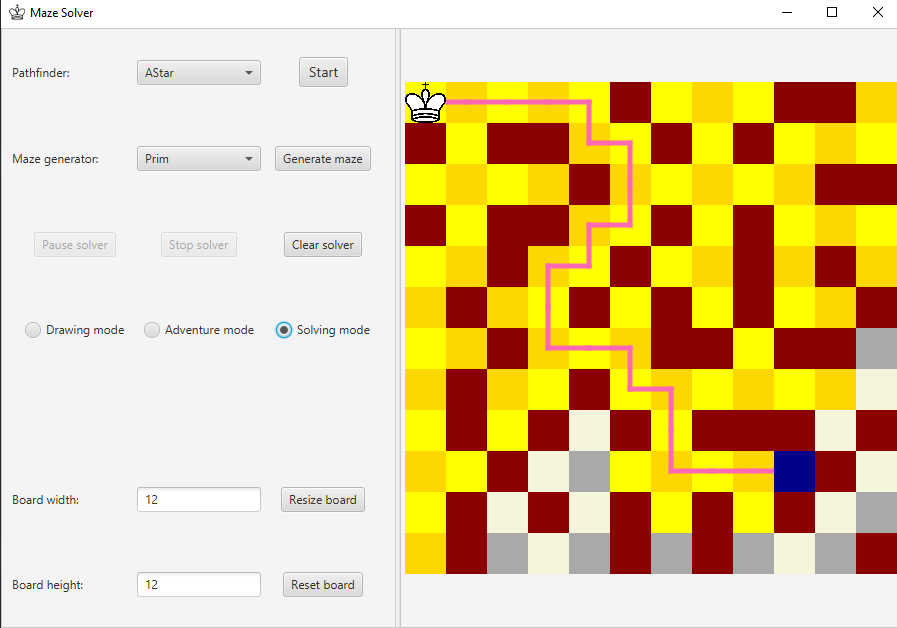
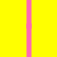

# Maze solver 

<a href="https://github.com/apohllo/obiektowe-lab/blob/master/proj2/PathfindingVisualizer.md"> Second project for Object Oriented Programming </a>

---

# About the program

This program allows user to create its own maze, try to go through it and if help is needed, use one of the available pathfinding algorithms. Currently, there are three ways of interacting with the map, called _modes_. These are:

- Drawing mode, allowing a user to draw his own maze. In this mode, the left mouse click adds a wall at the tile and right-click removes it. 
- Adventure mode, allowing a user to move freely king, trying to pass a maze. In this mode, movement is controlled using **WASD** keys.
- Solving mode, in which a user can specify the beginning and the end of the maze. Left-click chooses king position and right one ending node.

#### Running an algorithm

To run the algorithm user has to choose one, from the combo box at the top of the options list. Currently available algorithms:

- Depth-first search
- Breadth-first search
- A* algorithm

After starting simulation will show every tick current path chosen by the algorithm and colour all tiles discovered by it. You can pause the animation at any moment, but to perform any changes you need to stop it.

#### Generating the maze

You can generate a maze instead of drawing one using one of the following algorithms:

- Prim generator
- Random depth-first generator

After the maze generation, end tile will be moved to a random spot, due to the generators limitations. You can change it afterwards to which one you want.

 ---

## Visualization legend

-  - Current position [which is starting node for the solver],
-  - Ending node,
-  - Wall node, which cannot be traversed,
-  - Node discovered by the, algorithm during path finding,
-  - Pink chain visualizes current path found by the algorithm